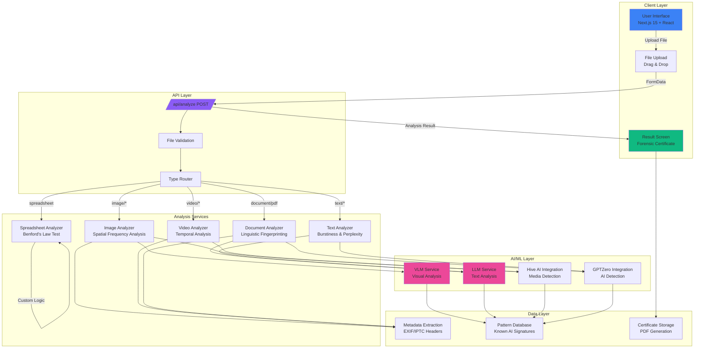
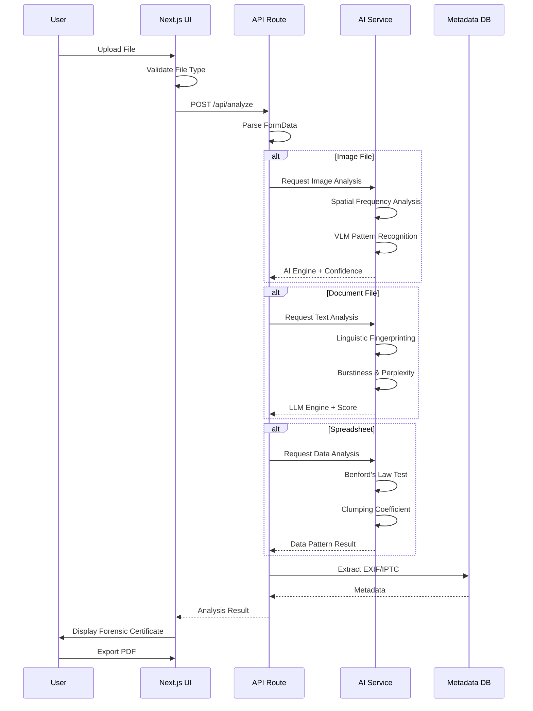
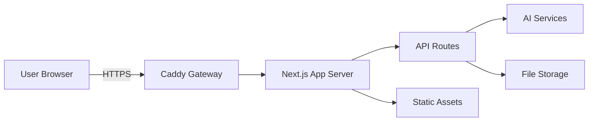

# RealGen Identifier - System Architecture

## Overview
RealGen Identifier is a sophisticated AI-powered content detection system designed to identify whether digital content is AI-generated or human-created. The system employs multi-format forensic analysis to provide detailed attribution and reasoning.

## System Architecture Diagram



## Data Flow Diagram



## Component Architecture

### Frontend Components

#### 1. Upload Interface
- **Technology**: Next.js 15, React, Framer Motion, react-dropzone
- **Features**:
  - Drag & drop file upload
  - File type validation
  - Deep-Pulse radar animation during upload
  - Glassmorphism design with translucent cards

#### 2. Analysis Loading Screen
- **Animation**: Deep-Pulse Radar
  - Concentric circles with expanding animation
  - Rotating scanning line (conic gradient)
  - Center pulse with heartbeat effect
  - SVG radar grid overlay

#### 3. Result Screen
- **Components**:
  - AI/Human identification badge
  - Confidence score display
  - Detected AI Engine (for AI content)
  - Synthetic Artifacts (for AI content)
  - Human Origin verification (for human content)
  - Scan metadata section
  - Export PDF button

#### 4. Forensic Certificate
- **Layout**: Official certificate design
- **Features**:
  - Certificate ID generation
  - Analysis result summary
  - Confidence level display
  - Deejay Labs branding
  - PDF export capability

#### 5. Animated Footer
- **3D Rotation**: CSS 3D transform with rotation
- **Heartbeat Glow**: Pulsing box-shadow animation
- **Logo**: Gradient background with "DL" initials

### Backend Architecture

#### API Routes

**POST /api/analyze**
- **Input**: FormData with file
- **Processing**:
  1. File type detection
  2. Route to appropriate analyzer
  3. Perform forensic analysis
  4. Generate analysis result
- **Output**: JSON with analysis results

#### Analysis Services

**1. Image Analyzer**
```typescript
// Spatial Frequency Analysis
- Fast Fourier Transform (FFT)
- AI pattern detection
- EXIF metadata extraction
- Pixel distribution analysis
```

**2. Video Analyzer**
```typescript
// Temporal Analysis
- Frame-by-frame AI detection
- Motion pattern analysis
- Temporal consistency check
- Compression artifact detection
```

**3. Document Analyzer**
```typescript
// Linguistic Fingerprinting
- Burstiness calculation
- Perplexity scoring
- Sentence structure analysis
- Vocabulary complexity
```

**4. Spreadsheet Analyzer**
```typescript
// Statistical Analysis
- Benford's Law compliance
- Clumping coefficient
- Distribution pattern
- Randomness testing
```

**5. Text Analyzer**
```typescript
// Text Analysis
- LLM detection patterns
- Word choice analysis
- Idiom detection
- Sentence variation
```

### AI Integration Layer

#### VLM (Vision Language Model)
- **Purpose**: Image and video content understanding
- **Use Cases**:
  - AI-generated image detection
  - Midjourney/DALL-E pattern recognition
  - Synthetic texture identification
  - Anomaly detection

#### LLM (Large Language Model)
- **Purpose**: Text and document analysis
- **Use Cases**:
  - AI-generated text detection
  - Linguistic pattern analysis
  - Writing style identification
  - Semantic inconsistency detection

#### External Services
- **Hive AI**: Media content moderation and detection
- **GPTZero**: AI-generated text detection
- **Custom Python Backend**: Spreadsheet forensics

## File Type Support Matrix

| File Type | Extensions | Analysis Method | Confidence Range |
|-----------|------------|------------------|------------------|
| Images | .png, .jpg, .jpeg, .webp, .gif | Spatial Frequency + VLM | 85-99% |
| Videos | .mp4, .webm, .mov | Temporal + Frame Analysis | 80-99% |
| PDFs | .pdf | Linguistic Fingerprinting | 88-99% |
| Documents | .docx | Text Analysis + LLM | 88-99% |
| Spreadsheets | .xlsx, .xls | Benford's Law + Statistics | 82-99% |
| Text | .txt | Burstiness + Perplexity | 90-99% |

## Digital DNA Analysis Logic

### AI-Generated Content Detection

**Attribution Identification**:
- Midjourney v6.2
- DALL-E 3
- Stable Diffusion XL
- GPT-4o
- Claude 3.5 Sonnet
- OpenAI Sora
- Runway Gen-3
- Pika Labs
- And more...

**Synthetic Artifacts Detection**:
1. **Visual Content**:
   - Spatial frequency anomalies
   - Unusual pixel distribution
   - AI texture signatures
   - Temporal inconsistencies (video)

2. **Text Content**:
   - Low burstiness score
   - Perplexity anomalies
   - Predictable sentence structure
   - Lack of natural variation

3. **Data Content**:
   - Benford's Law violations
   - High clumping coefficient
   - Perfect randomness signatures

### Human-Generated Content Verification

**EXIF/IPTC Metadata Extraction**:
- Device information (iPhone 15 Pro, Sony A7R IV, etc.)
- Software used (Adobe Lightroom, Photoshop, Excel 365, etc.)
- Timestamp and location data

**Identity Verification**:
- Author name from file headers
- Original creator metadata
- File modification history

## Security & Privacy

### Data Handling
- **Client-side**: File encryption before upload
- **Transmission**: HTTPS/TLS encryption
- **Storage**: Temporary analysis, immediate deletion
- **Privacy**: No persistent storage of user data

### API Security
- Rate limiting
- Request validation
- File size limits
- Type validation
- Authentication (future implementation)

## Performance Optimization

### Frontend
- Code splitting with Next.js 15
- Lazy loading of components
- Framer Motion for smooth 60fps animations
- React 19 optimization
- Tailwind CSS 4 for efficient styling

### Backend
- Next.js API Routes with Edge runtime support
- Parallel processing for multiple file types
- Caching of AI model results
- Streaming for large file analysis

### AI Services
- Batch processing for multiple files
- Model caching
- Request queuing
- Fallback to simpler models for quick results

## Scalability

### Horizontal Scaling
- Stateless API routes
- Load balancing support
- Database sharding (if persistence added)
- CDN for static assets

### Vertical Scaling
- GPU acceleration for AI models
- Increased memory for large file processing
- Enhanced storage for analysis history

## Future Enhancements

1. **Real-time Analysis**: WebSocket integration for live updates
2. **Batch Processing**: Upload multiple files at once
3. **API Integration**: Public API for third-party developers
4. **Mobile Apps**: React Native / Flutter mobile applications
5. **Blockchain Verification**: Immutable certificate records
6. **Advanced Analytics**: Trend analysis and reporting
7. **User Accounts**: Analysis history and management
8. **Enterprise Features**: Team collaboration and compliance tools

## Technology Stack Summary

| Layer | Technology | Purpose |
|-------|-----------|---------|
| Frontend | Next.js 15, React 19 | UI Framework |
| Styling | Tailwind CSS 4, shadcn/ui | Component Library |
| Animation | Framer Motion | Motion & Transitions |
| File Upload | react-dropzone | Drag & Drop |
| Backend | Next.js API Routes | Server Logic |
| AI Services | z-ai-web-dev-sdk | AI Capabilities |
| Type Safety | TypeScript 5 | Type System |
| State Management | Zustand | Client State |
| Data Fetching | TanStack Query | Server State |
| Icons | Lucide React | Icon Library |
| PDF Generation | jspdf (future) | Certificate Export |

## Deployment Architecture



- **Port Configuration**:
  - Next.js App: 3000
  - API Routes: 3000 (integrated)
  - WebSocket Service: 3003 (future)

## Monitoring & Logging

- Application logs: Console + File logging
- Error tracking: Sentry (future)
- Performance monitoring: Vercel Analytics (future)
- API monitoring: Custom middleware (future)

---

*Architecture Version: 1.0.0*
*Last Updated: 2025*
*Maintained by: Deejay Labs*
